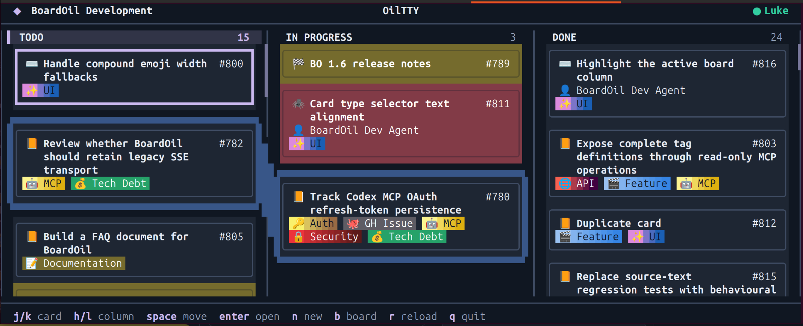

# OilTTY

Have you used all of your system memory running a local LLM but still need access to your favourite kanban board?

You need OilTTY, the text-based client for BoardOil.

Guaranteed smaller memory footprint than Chrome.



## Run

Requires the .NET 10 SDK. Currently only tested on Linux, I know, .NET & Linux, weird right?

From the repository root:

```sh
dotnet run --project OilTTY
```

OilTTY prompts for your BoardOil login on first run and saves the session for later runs.

To log out:

```sh
dotnet run --project OilTTY -- --logout
```

## Build a self-contained app

For Linux x64:

```sh
dotnet publish OilTTY/OilTTY.csproj \
  -c Release \
  -r linux-x64 \
  --self-contained \
  -p:PublishSingleFile=true \
  -o publish/oiltty-linux-x64
```

Run the published app:

```sh
./publish/oiltty-linux-x64/OilTTY
```

Other runtime identifiers, such as `linux-arm64`, `win-x64`, or `osx-arm64`, may work.

## The small print (read this bit really fast)

OilTTY requires a separate [BoardOil](https://github.com/dozigden/boardoil) install. OilTTY stores the selected server and login session in your user application-data directory. Session files contain a refresh token and are restricted to the current user where supported, but are not stored in an operating-system credential vault.
