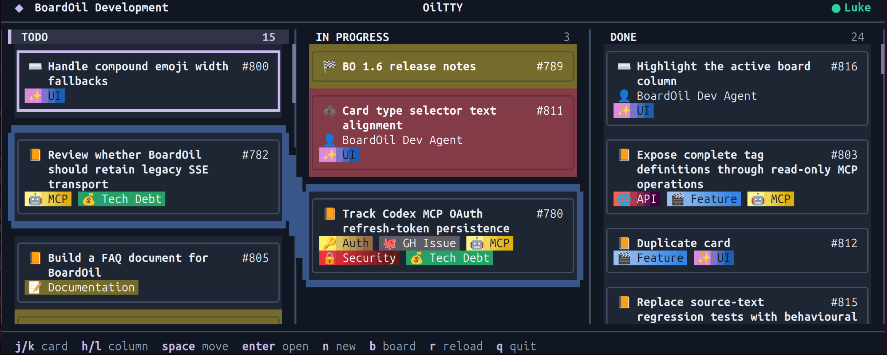
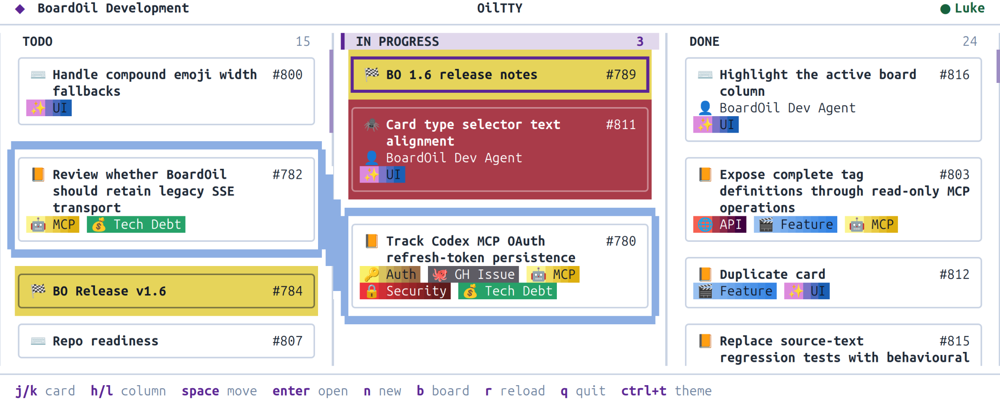

# OilTTY

Have you used all of your system memory running a local LLM but still need access to your favourite kanban board?

You need OilTTY, the text-based client for BoardOil.

Guaranteed smaller memory footprint than Chrome.



## Features

### Basics

OilTTY supports basic board navigation and card editing.  More advanced features are out - gotta keep that memory footprint down.

You can switch board, create, move, and edit cards. You'll have to wait for creating tags, types, and slicks though.

### Description and comment images

Attachment images embedded in card descriptions and comments render as
truecolour terminal art. OilTTY uses BoardOil's PNG thumbnails, combining quadrant
and sextant characters with smooth diagonal mosaic blocks and eighth-height and eighth-width blocks for finer edges and shapes. It
chooses the shape and two colours that best match each cell, without a
terminal-specific image protocol. Board cards remain compact, without previews.
Images remain raw Markdown while editing, and unavailable previews fall back to
their alt text.

Half blocks are always available. The default adds `quadrants,eighths,sextants,vertical-eighths,diagonals`;
disable any set your terminal does not render correctly. Each set can be selected
independently, or use `halfblocks` alone for the baseline. `eighths` controls
horizontal edges; `vertical-eighths` controls vertical edges; `diagonals` adds sloping
edges using the terminal graphics in Unicode Symbols for Legacy Computing.

Press **F2** from a board or card to edit these settings. Use the arrow keys and
Space to toggle sets while viewing a live preview of a loaded card image, or a
built-in sample. Choose **Save** (or press **Ctrl+S**) to apply the choice immediately
and remember it locally. **Escape** cancels without changing your settings.

Save your usual choice locally (this exits without signing in):

```sh
dotnet run --project OilTTY -- --save-image-glyphs quadrants,eighths,sextants,vertical-eighths,diagonals
```

This stores `imageGlyphs` in `oiltty/settings.json` beside the saved server.
On Linux that is normally `~/.config/oiltty/settings.json`, or
`$XDG_CONFIG_HOME/oiltty/settings.json` when configured. On other platforms OilTTY
uses the user's application-data directory.

For a temporary override:

```sh
dotnet run --project OilTTY -- --image-glyphs quadrants,eighths
# Or set OILTTY_IMAGE_GLYPHS in this terminal's environment:
OILTTY_IMAGE_GLYPHS=halfblocks dotnet run --project OilTTY
```

Startup precedence is command line → environment → saved setting → default.
Overrides do not overwrite the saved choice; explicitly saving in the F2 panel
does. You can also edit the settings file directly:

```json
{
  "imageGlyphs": "quadrants,eighths,sextants,vertical-eighths,diagonals"
}
```

### Full slick rendering

Are you a macOS Safari user fed up of your slicks not spanning columns? Good news! Coloured text offers a better experience than Safari! Slicks render fully across columns in OilTTY.

### Light mode

Why should web pages have all the dual theme fun? Light mode, just a ctrl-t away.



## Run

Requires the .NET 10 SDK. Currently only tested on Linux, I know, .NET & Linux, weird right?

From the repository root:

```sh
dotnet run --project OilTTY
```

To log out:

```sh
dotnet run --project OilTTY -- --logout
```

## Build a self-contained app

For Linux x64:

```sh
dotnet publish OilTTY/OilTTY.csproj \
  -c Release \
  -r linux-x64 \
  --self-contained \
  -p:PublishSingleFile=true \
  -o publish/oiltty-linux-x64
```

Run the published app:

```sh
./publish/oiltty-linux-x64/OilTTY
```

Other runtime identifiers, such as `linux-arm64`, `win-x64`, or `osx-arm64`, may work.

## The small print (read this bit really fast)

OilTTY requires a separate [BoardOil](https://github.com/dozigden/boardoil) install. OilTTY stores the selected server and login session in your user application-data directory. Session files contain a refresh token and are restricted to the current user where supported, but are not stored in an operating-system credential vault.

## License

OilTTY is licensed under the [MIT License](LICENSE). See
[Third-party notices](THIRD-PARTY-NOTICES.md) for the components used to build,
test, and distribute it.
